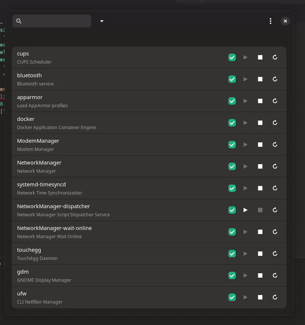
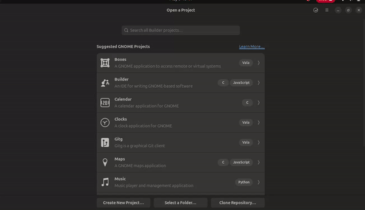

# SystemD Manager Control

It project wants make easy start/stop/enable/disable daemons in linux using SystemD.

### Features

<ul>
      <li>Enable/Disable on start service/path/socket/timer</li>
      <li>Start/Stop/Restart service/path/socket/timer</li>
</ul>

<br/><br/>




### Install project


#### Install system dependencies

```sh
sudo apt install libgtk-4-dev build-essential
```

#### Install rust

```sh
curl https://sh.rustup.rs -sSf | sh
```

#### Install project in your system

```sh
cargo check
meson --prefix=/usr build
ninja -C build
sudo ninja -C build install

```

#### Run project Using Gnome builder

- Install gnome builder https://flathub.org/apps/org.gnome.Builder

- Open it project and run:

